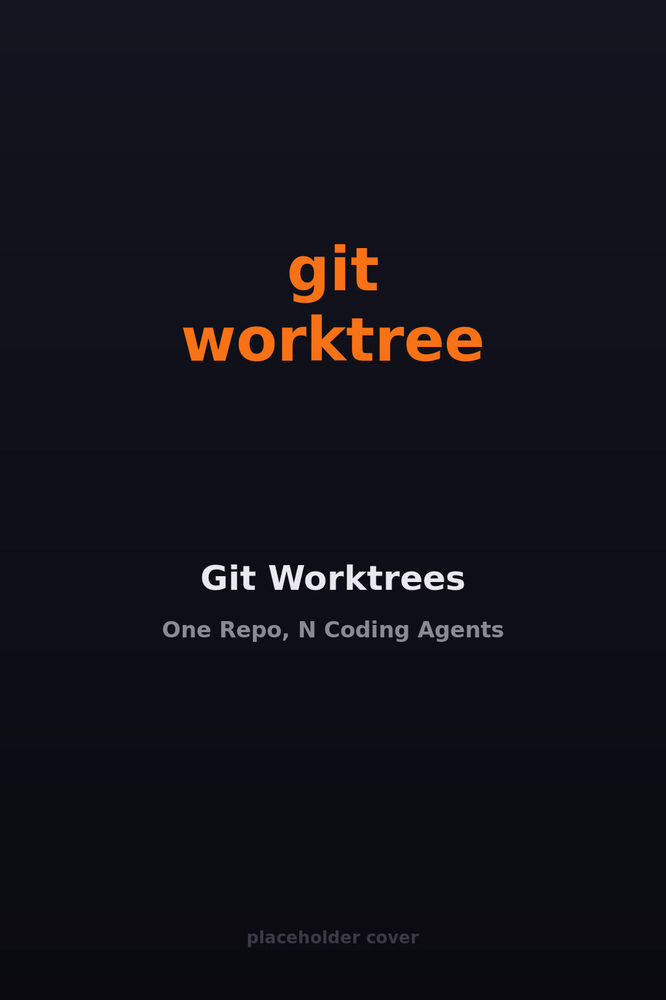

# Git Worktrees
## One Repo, N Coding Agents

::image::

---
layout: agenda
items:
  - Topic One
  - Topic Two
  - Topic Three
---

---
layout: section
---

# Topic One

::subtitle::

Optional subtitle

---
layout: default
---

# Slide Title

<v-clicks depth="2">

- First point
- Second point
- Third point

</v-clicks>

---
layout: socials
---

---
layout: source
source: itenium-be/git-worktrees
---

---
layout: end
---
